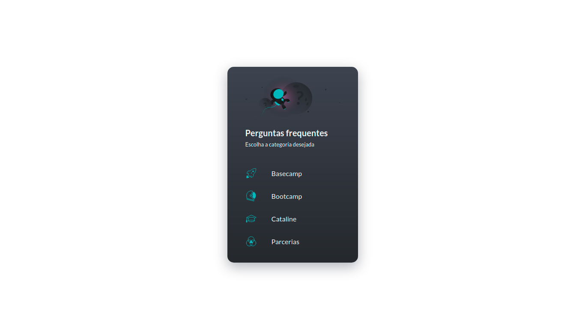
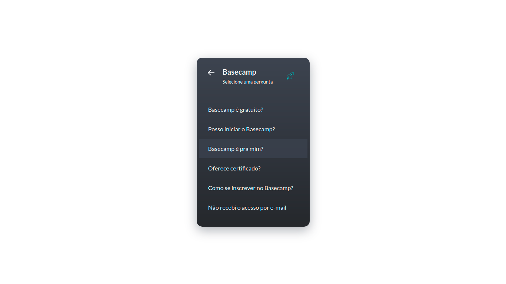
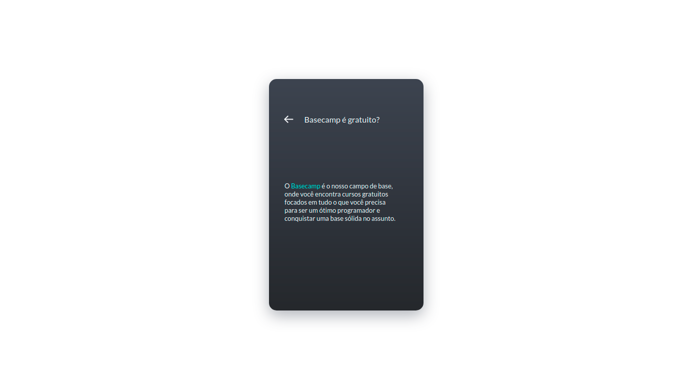

<h1 align="center">Treinando Vuex</h1>



<p align="center">Um simples porém bem elaborado menu de navegação paginado, 
construído com Vue, estilizado em Grid e gerenciamento de estado com Vuex. Este projeto faz parte do bootcamp da Cataline.</p>





## Como rodar o app:

```
yarn install
```

### Em modo de desenvolvimento

```
yarn serve
```

### Em modo de produção

```
yarn build
```

### Lints and fixes files

```
yarn lint
```

<p align="center">Desenvolvido por Gustavo Amorim</p>